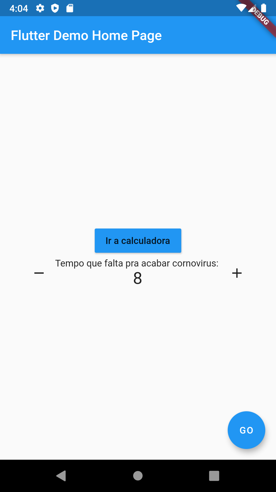
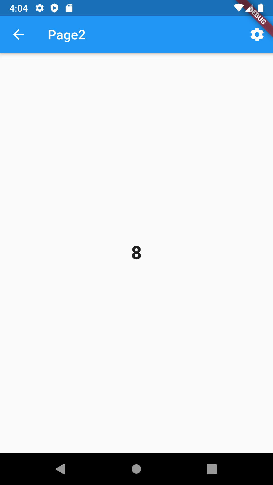
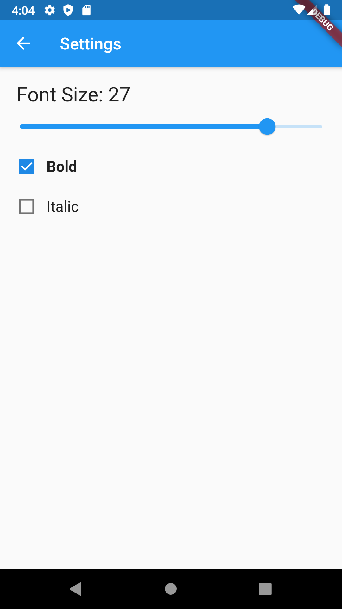

# stateapp

Projecto com intuito de explicar conceitos de gerenciamento de estado, a partir de exemplos de Provider, Redux e Mobx. O setState e o BloC são devidamente referenciados nos artigos relacionados a este tema,no medium (lsambo02).

## Screenshots

## Social media
[Twitter](https://twitter.com/lsambo02)

